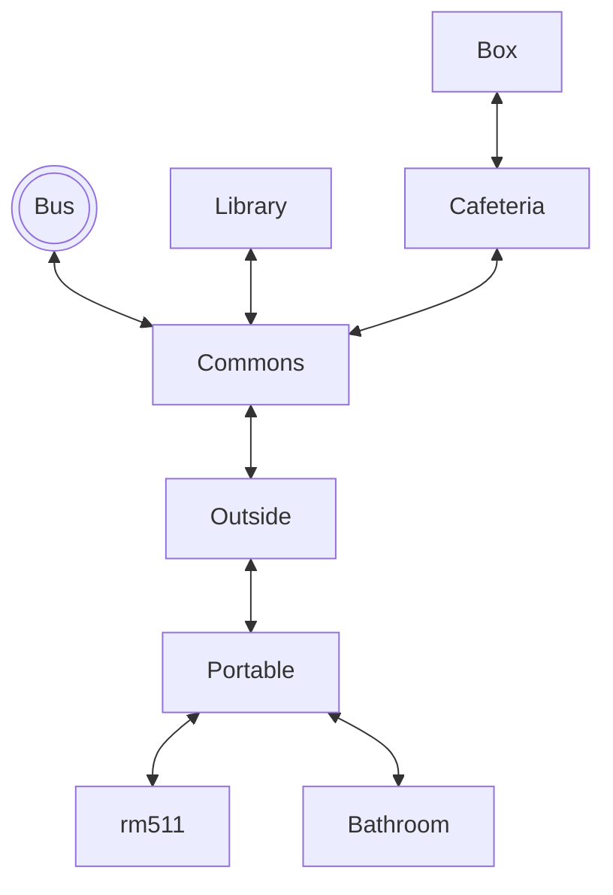

# Chris Needs Coffee

## Setting
This game is based off of the Scissor Seven Universe. I incorporated the main islands used in the show: Chicken Island, Xuanwu, and Stan Country.

## Map

The player starts on the bus, and then is directed into the Commons. T
They can explore, but must eventually make their way to rm511.

## Story
You start as the main character seven who aspires to be the top assassin. In his journey, he starts at Chicken Island (his home) and ventures to the following islands: Stan Country and Xuanwu. During his encounters on the islands he fights various foes to raise his rank.

## Global Variables

The most important variables are the enemy's health since it tracks and essentially operates the fights. These are boolean variables that track whether or not the enemy's health is above 0. If not, it plays the fight sequence (while also displaying the updated health after each attack). When it reaches 0 for both opponents, your rank will drop to 0, ending the game.

